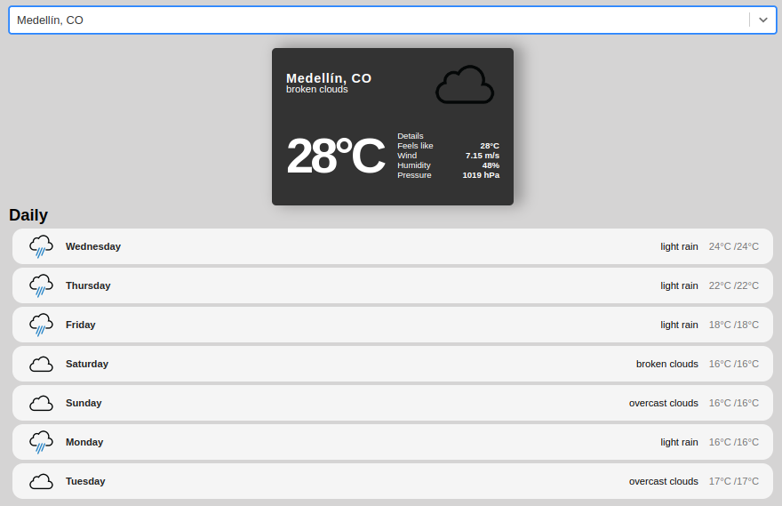

# Weather App

Esta aplicación del clima desarrollada en React te permite obtener información meteorológica actualizada de cualquier ubicación. Utiliza la API de OpenWeatherMap y RapidApi para obtener datos precisos y confiables. Con una interfaz de usuario amigable y atractiva, podrás conocer fácilmente las condiciones climáticas en tu área o en cualquier lugar del mundo.

## Características
Búsqueda por ubicación: Ingresa el nombre de la ciudad y obtén información detallada sobre el clima actual.

### Datos precisos
Utiliza la API de OpenWeatherMap y RapidApi para garantizar datos meteorológicos precisos y confiables.

### Interfaz intuitiva
Diseño limpio y fácil de usar que proporciona la información esencial de manera clara y rápida.

### Pronóstico extendido
Además del clima actual, puedes acceder a un pronóstico extendido para los próximos días.

## Captura de pantalla



## Configuración

1. Clona este repositorio en tu máquina local.

```
git clone https://github.com/tu-usuario/weather-app.git
```
2. Ingresa a la carpeta del proyecto.

```
cd weather-app
```
3. Instala las dependencias.
```
npm install
```
4. Obtén una clave de API de OpenWeatherMap y colócala en el archivo 

VITE_REACT_APP_RAPIDAPI_KEY=your_api_key
```
1. Inicia la aplicación.
```
npm run dev
```
## Contribuciones
¡Contribuciones son bienvenidas! Si encuentras algún problema o tienes alguna mejora, por favor abre un issue o envía un pull request.